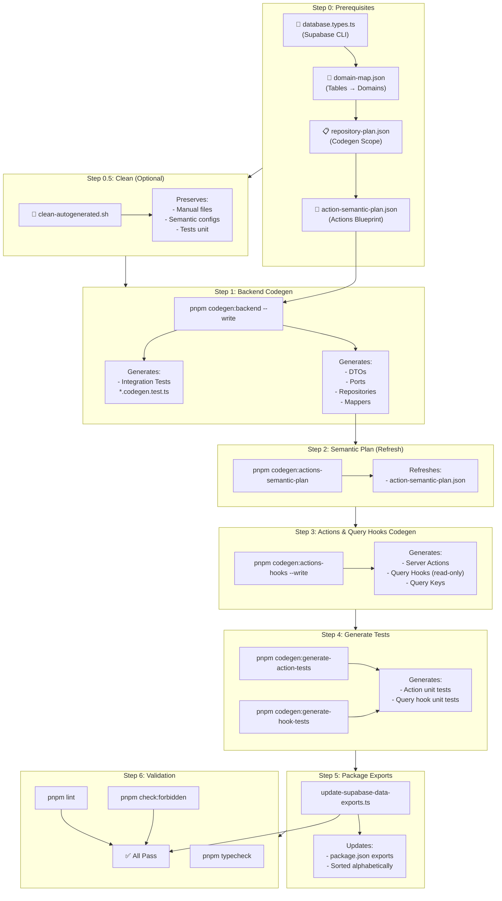
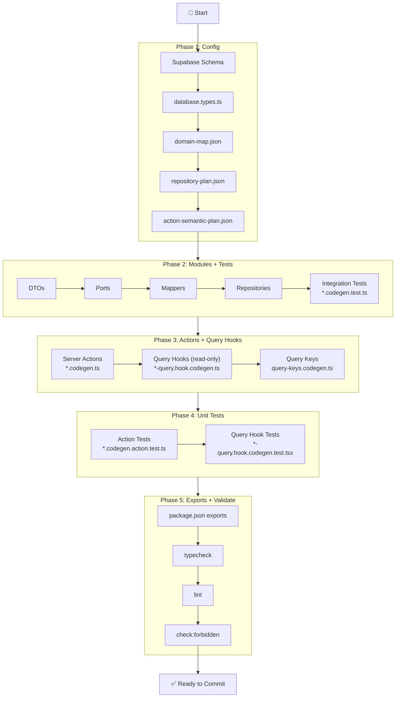

# Codegen Pipeline — Complete Diagram

**Visual guide to automated code generation flow.**

---

## 📊 Full Pipeline Overview



---

## 🔍 Detailed Step Breakdown

### Step 0: Semantic Config Generation

**Goal:** Generate ALL semantic config files from `database.types.ts`.

**This step generates:**

- ✅ `packages/supabase-infra/src/types/database.types.ts` (via Supabase CLI)
- ✅ `config/domain-map.json` (tables → domains mapping)
- ✅ `config/repository-plan.json` (defines codegen scope + methods)
- ✅ `config/action-semantic-plan.json` (blueprint for actions codegen)

**Commands:**

```bash
# 0.1: Generate Supabase types (if schema changed)
pnpm supabase:types:local

# 0.2: Create domain-map.json if missing
if [ ! -f config/domain-map.json ]; then
  cp config/domain-map.example.json config/domain-map.json
  # EDIT: Add your domains, set codegen: true/false per domain
fi

# 0.3: Validate domain-map aligns with database.types.ts
pnpm codegen:domain-map:validate
# If fails: pnpm codegen:domain-map:sync (see diff report)
# Then edit config/domain-map.json to fix mismatches

# 0.4: Generate repository-plan.json (if missing)
pnpm codegen:repository-plan:context
# EDIT: Specify methods per table, auth requirements
# Then validate:
pnpm codegen:repository-plan:validate -- --strict

# 0.5: Generate action-semantic-plan.json
pnpm codegen:actions-semantic-plan
# OPTIONAL: Edit to refine schemas, auth rules, tenant scoping
```

**Artifacts:**

- ✅ `packages/supabase-infra/src/types/database.types.ts`
- ✅ `config/domain-map.json`
- ✅ `config/repository-plan.json`
- ✅ `config/action-semantic-plan.json`

**Consumed By:**

- Step 1 (Backend Codegen) → reads `repository-plan.json` + `database.types.ts`
- Step 3 (Actions/Query Hooks) → reads `action-semantic-plan.json`

---

### Step 0.5: Clean Auto-Generated Files (Optional)

**When:** Before regenerating everything from scratch.

```bash
# Clean ALL auto-generated files (preserves manuals)
bash scripts/codegen/clean-autogenerated.sh

# Verify clean state
find packages/supabase-data/src/actions -type f -name '*.ts' | wc -l  # Should be 6 (manuals only)
find packages/supabase-data/src/modules -type f -name '*.ts' | wc -l  # Should be 0
find packages/supabase-data/src/hooks -type f -name '*.ts' | wc -l    # Should be 0
```

**What Gets Cleaned:**

- ✅ All `*.codegen.ts` files
- ✅ All `*.codegen.test.ts` files
- ✅ All `*.codegen.test.tsx` files

**What Gets Preserved:**

- ✅ Manual actions (`_shared/`, `user-access/`, `user-roles/`, `profiles/`,
  `example/`)
- ✅ All tests WITHOUT `.codegen.` in name
- ✅ Config files
- ✅ `packages/supabase-infra/`

---

### Step 1: Backend Codegen (Modules Layer)

**Goal:** Generate domain modules (DTOs, Ports, Repositories, Mappers).

**Prerequisites:**

- ✅ `config/repository-plan.json` (from Step 0)
- ✅ `packages/supabase-infra/src/types/database.types.ts` (from Step 0)

**Commands:**

```bash
# 1.1: Generate all modules from plan
pnpm codegen:backend --write

# OR generate specific domain
pnpm codegen:backend --write --domain patients

# 1.2: Validate generated modules
pnpm typecheck
pnpm lint
```

**Artifacts Generated:**

- ✅
  `packages/supabase-data/src/modules/<domain>/domain/dto/<table>.dto.codegen.ts`
- ✅
  `packages/supabase-data/src/modules/<domain>/domain/ports/<table>-repository.port.codegen.ts`
- ✅
  `packages/supabase-data/src/modules/<domain>/infrastructure/mappers/<table>.mapper.codegen.ts`
- ✅
  `packages/supabase-data/src/modules/<domain>/infrastructure/repositories/<table>-supabase.repository.codegen.ts`
- ✅ `tests/integration/supabase-data/modules/<domain>/<table>.codegen.test.ts`

**Consumed By:**

- Step 2 (Semantic Plan) — imports repository types
- Step 3 (Actions/Query Hooks) — imports repository classes

---

### Step 2: Semantic Plan (Refresh)

**Goal:** Regenerate `action-semantic-plan.json` if repository-plan changed.

**Commands:**

```bash
# 2.1: Generate semantic plan (already generated in Step 0, but can regenerate)
pnpm codegen:actions-semantic-plan

# 2.2: Review/edit semantic plan (optional but recommended)
# Edit: config/action-semantic-plan.json
# - Refine Zod schemas
# - Add auth rules
# - Specify tenant scoping
# - Define logging metadata

# 2.3: Validate semantic plan exists
ls config/action-semantic-plan.json
```

**Artifacts:**

- ✅ `config/action-semantic-plan.json`

**Consumed By:**

- Step 3 (Actions/Query Hooks Codegen) — reads this JSON to generate code

---

### Step 3: Actions & Query Hooks Codegen

**Goal:** Generate Server Actions and read-only TanStack Query hooks.

> ⚠️ **IMPORTANT:** Only **query hooks** are generated. **Mutation hooks do not
> exist** in this codebase and must not be created. All mutations go through
> Server Actions.

**Prerequisites:**

- ✅ `config/action-semantic-plan.json` (from Step 0/2)
- ✅ Generated modules (from Step 1)

**Commands:**

```bash
# 3.1: Generate all actions and query hooks
pnpm codegen:actions-hooks --write

# OR regenerate specific domain
pnpm codegen:actions-hooks --write --domain patients
```

**Artifacts Generated:**

- ✅ `packages/supabase-data/src/actions/<domain>/<table>-<method>.codegen.ts`
- ✅
  `packages/supabase-data/src/hooks/<domain>/use-<table>-query.hook.codegen.ts`
- ✅ `packages/supabase-data/src/hooks/<domain>/query-keys.codegen.ts`

**NOT generated (do not create these manually):**

- ❌ `use-<table>-mutation.hook.codegen.ts` — mutation hooks do not exist

**Generated Code Pattern:**

```typescript
// packages/supabase-data/src/actions/patients/psychologist-patients-list.codegen.ts
/**
 * codegen:output (generated)
 */
"use server"

import { requireAuth } from "@workspace/supabase-data/lib/auth/require-auth"
import { createServerAuthClient } from "@workspace/supabase-auth/server/create-server-auth-client"
import { PsychologistPatientsSupabaseRepository } from "@workspace/supabase-data/modules/patients/infrastructure/repositories/psychologist-patients-supabase.repository.codegen"
import { logServerEvent } from "@workspace/logging/server"

export async function listPsychologistPatientsAction(
  input: ListPsychologistPatientsInput
): Promise<{ data: PsychologistPatientsDTO[]; total: number }> {
  // 1. Auth check (SSOT via requireAuth)
  const claims = await requireAuth({
    action: "list_psychologist-patients",
  })

  const userId = claims.sub

  // 2. Validate input
  const validated = ListPsychologistPatientsInputSchema.parse(input)

  // 3. Create auth client + repository
  const supabase = await createServerAuthClient()
  const repository = new PsychologistPatientsSupabaseRepository(supabase)

  // 4. Execute with explicit filters (mirrors RLS, enables index)
  const result = await repository.findByPsychologistId(psychologistId)

  // 5. Log success
  await logServerEvent({
    /* ... */
  })

  return { data: result, total: result.length }
}
```

**Consumed By:**

- Step 4 (Tests) — generates tests for these actions/hooks
- Step 5 (Package Exports) — adds exports for these paths
- App components — import and use these actions/hooks

---

### Step 4: Generate Tests

**Goal:** Generate unit tests for actions and query hooks.

**Commands:**

```bash
# 4.1: Generate action unit tests
pnpm codegen:generate-action-tests --write

# 4.2: Generate hook unit tests
pnpm codegen:generate-hook-tests --write
```

**Artifacts Generated:**

- ✅
  `tests/unit/supabase-data/actions/<domain>/<table>-<method>.codegen.action.test.ts`
- ✅
  `tests/unit/supabase-data/hooks/<domain>/<table>-query.hook.codegen.test.tsx`

**What Each Test Covers:**

**Action Tests:**

- ✅ Authentication (unauthorized throws)
- ✅ Input validation (Zod errors)
- ✅ Tenant isolation
- ✅ Logging (success + failure)

**Query Hook Tests:**

- ✅ Query hook fetches data on mount
- ✅ Query key factory consistency
- ✅ Error handling

**NOT generated:**

- ❌ `<table>-mutation.hook.codegen.test.tsx` — no mutation hooks exist

---

### Step 5: Package Exports Update

**Goal:** Update package.json with explicit exports for all generated paths.

**Commands:**

```bash
# 5.1: Update exports automatically
pnpm tsx scripts/codegen/update-supabase-data-exports.ts

# 5.2: Verify exports were added
grep -c '"./actions/\|"./hooks/\|"./modules/' packages/supabase-data/package.json
```

**Artifacts Updated:**

- ✅ `packages/supabase-data/package.json` → `exports` field

---

### Step 6: Validation

**Goal:** Ensure generated code is correct and compiles.

**Commands:**

```bash
# 6.1: Type check
pnpm typecheck

# 6.2: Lint
pnpm lint

# 6.3: Forbidden patterns check
pnpm check:forbidden
```

**Checks:**

- TypeScript types (imports, signatures, schemas)
- Oxlint rules (no console.log, proper imports, no undefined)
- Forbidden patterns (no getSession in server, no packages/ui edits, no
  database.types.ts edits)

**Expected Results:**

- ✅ `pnpm typecheck` — 0 errors
- ✅ `pnpm lint` — 0 errors (warnings OK)
- ✅ `pnpm check:forbidden` — OK

---

## 📊 File Count Summary

| Category              | Files Generated | Location                                     |
| --------------------- | --------------- | -------------------------------------------- |
| **Modules**           | ~500            | `packages/supabase-data/src/modules/`        |
| **Integration Tests** | ~66             | `tests/integration/supabase-data/modules/`   |
| **Server Actions**    | ~290            | `packages/supabase-data/src/actions/`        |
| **Query Hooks**       | ~146            | `packages/supabase-data/src/hooks/`          |
| **Query Keys**        | ~19             | `packages/supabase-data/src/hooks/<domain>/` |
| **Action Unit Tests** | ~290            | `tests/unit/supabase-data/actions/`          |
| **Hook Unit Tests**   | ~146            | `tests/unit/supabase-data/hooks/`            |
| **Package Exports**   | ~436            | `packages/supabase-data/package.json`        |

> **Note:** Query hooks listed above are **read-only** query hooks only.
> Mutation hook files and mutation hook tests are **not generated**.

---

## 🎯 Complete Flow: From Schema to Code



---

## 🔑 Key Concepts

### What is the `*.codegen.*` naming convention?

**Pattern:**

- Auto-generated (removed by `pnpm codegen:clean`): `*.codegen.ts`,
  `*.codegen.test.ts`, `*.codegen.*.test.ts`
- Manual: `*.ts` without `.codegen.` in the filename
- Backend module stubs (`codegen:backend`): normal `*.ts` names with first line
  `// codegen:backend — …` for overwrite detection — **not** deleted by clean

**Purpose:**

- Easy cleanup with `find -name "*.codegen.*" -delete`
- No need to `grep` file content
- MUCH FASTER than reading every file

### What Tests Are Auto-Generated?

**Generated:**

- ✅ `tests/integration/supabase-data/modules/<domain>/<table>.codegen.test.ts`
- ✅
  `tests/unit/supabase-data/actions/<domain>/<table>-<method>.codegen.action.test.ts`
- ✅
  `tests/unit/supabase-data/hooks/<domain>/<table>-query.hook.codegen.test.tsx`

**NOT generated:**

- ❌
  `tests/unit/supabase-data/hooks/<domain>/<table>-mutation.hook.codegen.test.tsx`
  — mutation hooks do not exist

**Manual (Preserved):**

- ✅ `tests/unit/codegen/*.test.ts` — Tests OF codegen logic
- ✅ `tests/integration/supabase-auth/*.test.ts` — Auth integration tests
- ✅ `tests/e2e/*.spec.ts` — End-to-end tests

### When to Regenerate?

**Regenerate When:**

- ✅ Database schema changed (new tables/columns)
- ✅ domain-map.json updated
- ✅ repository-plan.json updated
- ✅ Codegen templates updated

**Don't Regenerate When:**

- ❌ Only implementing business logic in TODOs
- ❌ Only fixing bugs in manual files
- ❌ Only adding new manual tests

---

**This diagram is the canonical reference for the codegen pipeline.** 📚
