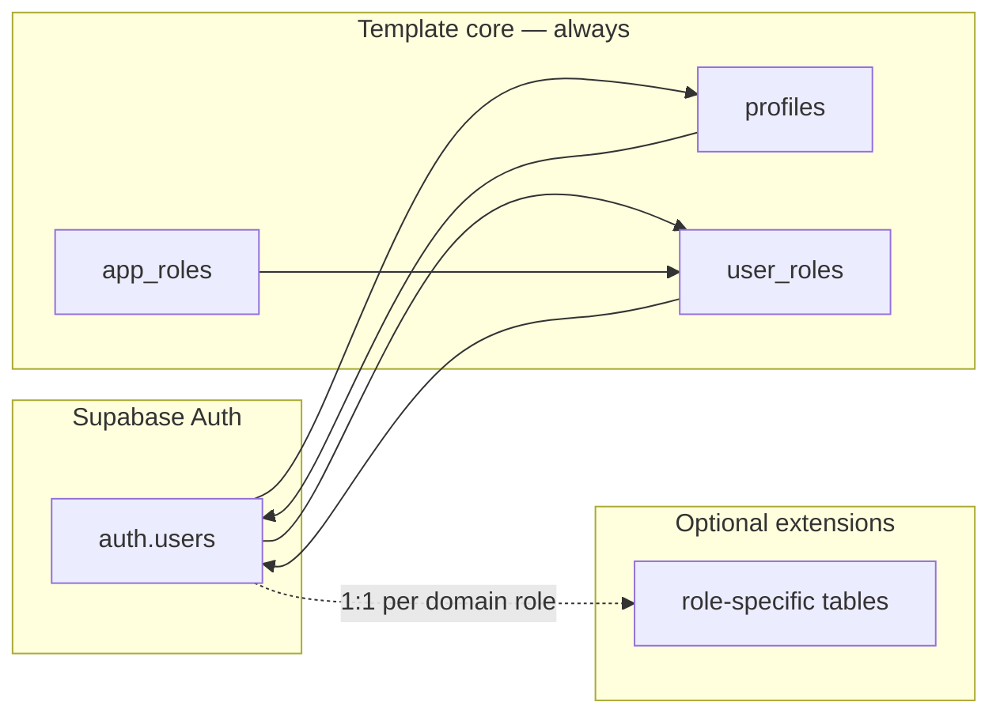

# Template baseline schema (first migrations)

This guide describes the **recommended first database layer** for projects using
this template: **observability** (append-only events) and **identity**
(profiles, role catalog, JWT enrichment). It matches the minimal tables in
`packages/supabase-infra/src/types/database.types.ts` when generated from a
small local schema.

## Where the SQL lives

| Location                                                         | Role                                                              |
| ---------------------------------------------------------------- | ----------------------------------------------------------------- |
| `supabase/template-baseline/0001_identity_and_observability.sql` | Reference DDL: identity + `observability_events` + hooks          |
| `supabase/template-baseline/0002_role_extension_pattern.sql`     | Comments + example pattern for multi-role extensions              |
| `supabase/migrations/*.sql`                                      | **Actual** migration history for this repo (large product schema) |

Files under `supabase/template-baseline/` are **not** applied by
`supabase db reset`. They are for **greenfield** forks or documentation.

## `auth.users` vs `public.profiles`

Supabase Auth already stores **canonical identity** in `auth.users` (id, email,
phone, `raw_user_meta_data`, etc.). The baseline adds `public.profiles` as a
**1:1 app row** keyed by `user_id → auth.users.id` for display fields
(`full_name`, `avatar_url`), **subscription** (JSON snapshot), and
`access_version`. Do **not** duplicate email or phone on `profiles`; read them
from Auth APIs or privileged access to `auth.users` when you need them in app
code.

**Roles** live in `user_roles` + `app_roles`. **Permissions** are optional: the
baseline ships with an empty permissions array in JWT; see commented
`user_permissions` DDL and comments in `get_user_access_payload_core` /
`custom_access_token_hook` in `0001` to enable fine-grained claims.

Register the hook in the Dashboard or `supabase/config.toml`
(`[auth.hook.custom_access_token]` →
`pg-functions://postgres/public/custom_access_token_hook`).

## Subscription in the JWT vs in the database

**Database (`profiles.subscription`)** holds the **full** entitlement snapshot
your server writes (webhooks, admin tools): plan fields and **Stripe object
ids** for server-side lookups only (never in JWT). See **Stripe: Accounts v2 and
storage** below for how `acct_` relates to `cus_` in greenfield Connect +
Billing.

## Stripe: API version, Accounts v2 (`acct_`), and storage

**Pin your Stripe API version** in the server SDK (`apiVersion`) and follow
[upgrades](https://docs.stripe.com/upgrades) /
[set-version](https://docs.stripe.com/sdks/set-version). Stripe ships monthly
API versions; named releases may include breaking changes.

**Accounts v2**
([Connect / Accounts v2](https://docs.stripe.com/connect/accounts-v2)): a single
**`acct_` id** can carry multiple **configurations** (e.g. `merchant` for
Connect payouts, `customer` so the same account can be charged platform SaaS
subscriptions, `recipient` where applicable). That replaces the older v1 pattern
of maintaining a separate **`cus_`** for “psychologist pays the platform” while
also having an **`acct_`** for Connect—see
[SaaS platform payments & billing](https://docs.stripe.com/connect/accounts-v2/saas-platform-payments-billing)
and
[Use accounts as customers](https://docs.stripe.com/connect/use-accounts-as-customers)
(`customer_account` on Billing/Payments APIs where supported).

**Greenfield multi-actor (e.g. Fluri-style) — typical mapping:**

| Actor                                           | What to persist (examples)                                                                                                                        | Notes                                                                                                                                   |
| ----------------------------------------------- | ------------------------------------------------------------------------------------------------------------------------------------------------- | --------------------------------------------------------------------------------------------------------------------------------------- |
| **Psychologist (Connect + pays platform SaaS)** | `stripe_account_id` → **`acct_`** (v2 account with merchant + customer configs); `stripe_subscription_id` → **`sub_`** for platform recurring fee | Prefer **one `acct_`** + `customer_account=acct_…` on Subscriptions over a parallel **`cus_`** for the same person when on Accounts v2. |
| **Patient (payer only)**                        | Often **`cus_`** (v1 Customer) or a v2 Account with **customer** config only—product choice                                                       | Simpler flows often keep **`cus_`** for pure payers; unify only if you need the same identity model everywhere.                         |

Stripe object ids are **case-sensitive** and may be **long**; use **`text`** (or
`varchar(255)`) in Postgres for dedicated columns. Prefer **separate
keys/columns** per id type (`stripe_account_id`, `stripe_customer_id`,
`stripe_subscription_id`, …) rather than one opaque `stripe_id`—each object has
its own lifecycle and webhooks.

**Limitations (check current docs before committing):** Accounts v2 is **not**
compatible with **OAuth** Connect onboarding (stay on v1 for those flows).
Subscription **webhook** types remain largely **v1**
(`customer.subscription.*`); v2 account lifecycle may use **thin** events (fetch
full object after `evt_`). **Idempotency:** dedupe webhook processing on event
**`id`** (`evt_`).

**Security:** Secret keys (`sk_`, restricted keys) stay server-only; **object
ids** (`cus_`, `acct_`, `sub_`, …) are not API secrets but are still sensitive
in logs and client surfaces—keep them **out of JWT** in this template;
PaymentIntent **client_secret** is sensitive and customer-scoped.

**JWT (`app_metadata.subscription`)** is **not** a copy of the full JSON. The
hook passes the result of **`subscription_claims_for_jwt(subscription)`** — a
**whitelist** of non-sensitive keys safe for client-readable tokens (e.g.
`status`, `plan_id`, `plan_tier`, `current_period_end`, `provider`). Do **not**
rely on the browser seeing Stripe ids or payment data in JWT; keep those in the
DB and use **RLS + server checks** for gated operations.

RPCs such as **`get_my_access_payload`** return the **full** `subscription` from
`get_user_access_payload_core` (unfiltered) for trusted server use.

Flow:

1. **Read path (hook)** — `get_user_access_payload_core` loads
   `profiles.subscription`; `custom_access_token_hook` sets
   `app_metadata.subscription` to `subscription_claims_for_jwt(...)`, plus
   `roles`, `access_version`, `permissions`.
2. **Update path (server-side)** —
   **`sync_profile_subscription(user_id, jsonb)`** (service role) merges into
   `profiles.subscription` (`jsonb ||`), bumps `access_version`. Webhooks can
   store provider ids here; they do **not** automatically appear in JWT unless
   you add them to `subscription_claims_for_jwt` (generally avoid).
3. **Stale sessions** — JWTs are TTL-bound; compare `access_version` and
   refresh. **Immediate** downgrade / fraud holds require **server-side**
   enforcement (RLS, Edge, payment provider check), not JWT-only.

Role changes use **`sync_user_roles`**, which also bumps `access_version`.

## When to validate on the server with the database

The baseline is optimized so **most** requests avoid extra queries **only to
read** roles or subscription tier: that information is already in
**`app_metadata`** on the JWT after issue/refresh.

Still **hit Postgres (or a trusted RPC that reads it)** in these cases:

1. **Sensitive or irreversible operations** — payments, refunds, issuing
   credentials, access to regulated data (e.g. clinical), or anything that must
   reflect **immediate** revocation. Do not rely on JWT-only; enforce with RLS,
   Edge Functions, or server actions that read current rows / call the provider.

2. **Suspected stale JWT** — after a webhook or admin mutation updated roles or
   subscription, the browser may still hold an old token until refresh. Compare
   **`app_metadata.access_version`** (JWT) with **`access_version` from the DB**
   (e.g. `get_my_access_payload()` or a lightweight RPC). If they differ, call
   **`refreshSession()`** (or equivalent) and optionally re-run the gate. That
   extra read is **point-in-time** (after mutations or when reconciling), not a
   per-request loop for every static page view.

**Default for “first paint” / layout / non-sensitive routing:** use JWT claims
from the session; **no** subscription/role query **only** for that. Add DB
validation deliberately where the product requires stronger guarantees.

## Hook performance and safety

- The hook runs on **every** access-token issue and **refresh**. Keep
  **`get_user_access_payload_core`** cheap: single-row read on `profiles` (PK on
  `user_id`) and aggregation on `user_roles` (indexed by `user_id`). Avoid
  adding heavy joins in the hook path; move multi-table resolution to
  **materialized** snapshots or **server-side** checks.
- The hook should **only read** and return merged `claims`; **writes** go
  through `sync_*` RPCs and webhooks (service role).
- Preserve **Auth-issued** claims: return
  `jsonb_build_object('claims', claims)`; do not strip `iss`, `exp`, `sub`,
  `role`, etc., unless you follow current Supabase hook documentation.

## Organization-level billing (fork)

When the **Stripe Customer** (or billing entity) is an **organization**, not
each user, store `stripe_customer_id` / subscription state on an
**`organizations`** (or similar) row, not on `profiles`. Membership rows link
users to orgs and roles. You must **fork** this baseline: JWT `subscription` may
need **org-scoped** entitlements or **server-only** checks; multi-org users
complicate which snapshot belongs in `app_metadata`. See commented notes in
`supabase/template-baseline/0002_role_extension_pattern.sql`.

## Dual-role accounts

If one `auth.users` row can be **both** (e.g.) provider and patient,
**`user_roles`** can hold multiple roles and extension tables can both exist.
RLS and the hook grow in complexity; the minimal baseline does not automate
every dual-role edge case—plan policies and tests explicitly.

## Why two layers?

1. **Observability** — One append-only table for structured operational and
   security-relevant events. Inserts use the **service role** from Edge/Node;
   `anon` / `authenticated` have no privileges. RLS stays enabled for defense in
   depth; `service_role` bypasses RLS in Supabase.

2. **Identity core** — One row per `auth.users` id in `profiles`, many-to-many
   `user_roles` referencing a catalog `app_roles`, and RPCs used by
   `custom_access_token_hook` to mirror `roles`, `permissions`,
   `access_version`, and `subscription` into JWT `app_metadata`.

## Multi-role vs single-role apps



- **Single primary role** (e.g. SaaS with one “user” type): use only `profiles`
  - `user_roles` with one row (e.g. `member`). Add columns to `profiles` as
    needed.

- **Multiple actor types** (e.g. **Fluri-style**: psychologists and patients as
  first-class UX): keep the same core. Add **one extension table per actor
  type** (e.g. `psychologist_profiles`, `patient_profiles`) with
  `user_id UUID PRIMARY KEY REFERENCES auth.users(id)`. Put domain-specific
  columns and FKs there; keep `profiles` for subscription snapshot,
  `access_version`, and shared display fields. RLS on extensions should tie to
  `auth.uid()` and, where needed, to membership in `user_roles` or claims.

Details and commented examples:
`supabase/template-baseline/0002_role_extension_pattern.sql`.

## Fluri-style: psychologists, patients, assistants

In a multi-actor product, **canonical identity stays `auth.users`** (id, email,
phone). Everything in `public` is **app-owned** data keyed by that id.

### Thin `profiles` + one extension table per domain role

Recommended shape:

| Layer                                           | Purpose                                                                                                                                                                                                                                                            |
| ----------------------------------------------- | ------------------------------------------------------------------------------------------------------------------------------------------------------------------------------------------------------------------------------------------------------------------ |
| **`auth.users`**                                | Single source of truth for credentials and contact fields you get from Auth.                                                                                                                                                                                       |
| **`public.profiles`** (or a rename — see below) | **One row per user** (1:1 with `auth.users`), holding only what is **shared by every** user type you model: e.g. `full_name`, `avatar_url`, **`access_version`**, and optionally a **generic** `subscription` jsonb (see strategies).                              |
| **`user_roles` + `app_roles`**                  | Which **hats** this account has (`psychologist`, `patient`, `assistant`, …). Drives UX routing and RLS; not a substitute for extension rows.                                                                                                                       |
| **Extension tables**                            | **Optional, when applicable** — one table per actor **type** only if that role needs **its own** columns and FKs. Example: `psychologist_profiles`, `patient_profiles`. Put **only** fields that belong to that role: clinical prefs, billing IDs, org links, etc. |

**When `profiles` alone is enough:** many products need **only** `auth.users` +
`profiles` + `user_roles` (and the hook RPCs). That is enough when all users
share the **same** logical shape (e.g. single-role SaaS, or a few roles with
overlapping fields) — you add columns to `profiles` and distinguish behavior
with `user_roles`. **Extension tables** are not mandatory; add them when schemas
**diverge** by actor (different columns, different FK targets, cleaner RLS per
table) and you want to avoid a wide `profiles` full of `NULL`s.

**“When applicable”** means: create a row in `psychologist_profiles` only for
users who **are** psychologists; patients may have no row there. It also means:
**skip extension tables entirely** if your product never needs that split.

Patients and assistants typically **do not** pay for the same “SaaS plan” as the
psychologist. That does **not** require removing `profiles`; it requires a
**clear rule** for where billing state lives (see subscription strategies).

### Renaming `profiles`

The name `profiles` is a **template convention**. If it collides with your
product language (“profile” = public psychologist page vs “account”):

- You may rename the table (e.g. `account_profiles`, `user_accounts`) in a
  **real migration** and update every reference: RLS policies, FKs from other
  tables, and especially **`get_user_access_payload_core`**,
  **`sync_user_roles`**, **`sync_profile_subscription`**, and
  **`custom_access_token_hook`** (they read/write `public.profiles` in `0001`).

There is **no** requirement to rename: many teams keep `profiles` as the **thin
shared row** and use **role-specific** names only on extension tables
(`psychologist_profiles`, …).

### Subscription when only some roles are billable

Two established options:

1. **Single column on the thin row (simplest)** — Keep `profiles.subscription`
   as `jsonb NOT NULL DEFAULT '{}'::jsonb`. **Psychologists** get full keys in
   the DB (`status`, `plan_id`, optional Stripe ids for webhooks). **Patients
   and assistants** keep `{}` in the DB. The JWT always carries
   **`subscription_claims_for_jwt`** output (empty object if no whitelisted
   keys); Stripe customer/subscription ids stay **out of JWT** unless you extend
   the whitelist (not recommended). **`sync_profile_subscription`** only for
   billable users as needed.

2. **Subscription only on the extension table** — Add `subscription jsonb` (or
   normalized billing columns) **only** on `psychologist_profiles`. Then you
   **must** change `get_user_access_payload_core` to build the JWT subscription
   from that table (e.g. `LEFT JOIN` + `COALESCE`) when the user is a
   psychologist, and return `'{}'::jsonb` otherwise; and replace or wrap
   `sync_profile_subscription` with a function that updates
   `psychologist_profiles` instead of `profiles`. This keeps the thin row free
   of billing for non-payers at the cost of **custom SQL**.

For most teams, **option 1** is enough: empty jsonb is cheap, and the JWT shape
stays uniform.

### Assistants

Model assistants either as:

- **`assistant_profiles`** (1:1 with `auth.users`), if the assistant is a full
  login with their own identity; or
- A **membership** table (e.g. assistant linked to a practice/psychologist) if
  “assistant” is not a global role but a relationship — your domain FKs live in
  extension tables, not in `profiles`.

### Mental model

```text
auth.users          ← canonical identity (always)
    │
    ├── profiles    ← shared: display + access_version + optional subscription jsonb
    ├── user_roles  ← which roles apply to this account
    ├── psychologist_profiles  ← psychologist-only columns + optional billing
    ├── patient_profiles       ← patient-only columns
    └── assistant_profiles     ← assistant-only columns (or use membership table)
```

## Applying on a greenfield database

Do **not** paste into a random path. Follow
[migration-workflow.md](./migration-workflow.md):

1. `pnpm supabase:migration:new -- template_baseline_identity_observability`
2. Apply the contents of `0001` on the local DB (Studio/psql), or merge sections
   carefully — extensions and grants may need trimming if your project already
   has them.
3. `pnpm supabase db diff -o supabase/migrations/<that-file>.sql`
4. If the diff strips headers, `pnpm supabase:migration:stamp -- <file>`
5. `pnpm supabase:types:local` and merge fixes in `database.ts` if needed (see
   AGENTS.md).

Seed `app_roles` (labels, `is_self_sign_up_allowed`) in `supabase/seed.sql` or a
follow-up migration so `user_roles` FK inserts are valid.

## Relationship to this repository

This monorepo’s **tracked** migrations include a full product schema (e.g.
`20260128113707_core_schema.sql` and later files). The template-baseline folder
is the **minimal** story for new projects and for aligning docs with
`database.types.ts` generated from a trimmed local reset.
